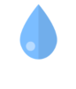

<!-- README.md is generated from README.Rmd. Please edit that file -->

# WaterOfIndia

<!-- badges: start -->

<!-- badges: end -->

The goal of WaterOfIndia is to list all Inland water bodies in India and
calculate the area covered by them. There is also an intention to check
the seasonality of the water bodies i.e. the change in area based on
season/time of a year. This project is designed to support [Centre for
Aquatic Livelihood Jaljeevika](https://www.jaljeevika.org/), a social
initiative by [Ashoka
Fellow](https://www.ashoka.org/en-us/ashoka-fellows) [Neelkanth
Mishra](https://www.ashoka.org/en/fellow/neelkanth-mishra).

# Contributors

1.  [Ashutosh Vyas](https://www.linkedin.com/in/ashutosh-vyas)
2.  [Lakshmi Shamarao
    Araga](https://www.linkedin.com/in/lakshmishamarao)
3.  [Vijay V
    Venkitesh](https://www.linkedin.com/in/vijay-v-venkitesh-673177204/)
4.  [Sakshi
    Rikhe](https://www.linkedin.com/in/sakshi-rikhe-サクシ-リケ-3b5049a2)
5.  [Asitav Sen](https://asitavsen.com)
